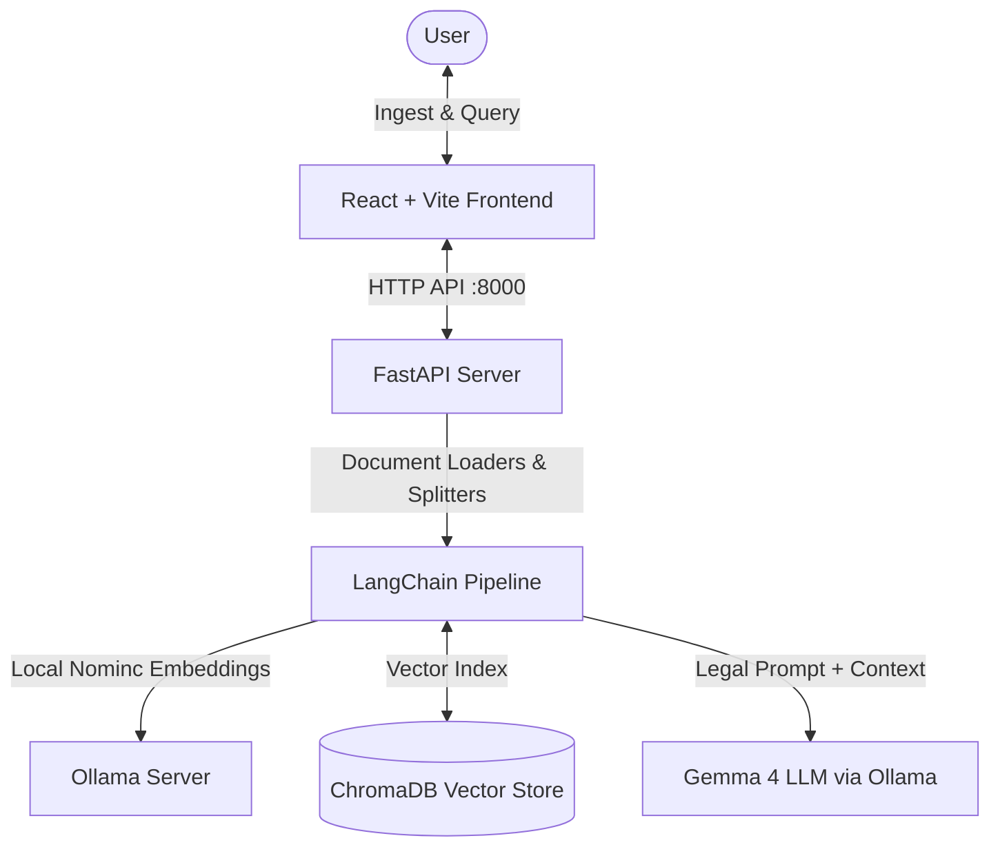

# NTU SCTP RAG Exercise 🚀

A high-performance Classical Retrieval-Augmented Generation (RAG) application. This repository combines a modern, lightning-fast **FastAPI backend** (powered by Python 3.13, `uv`, LangChain, and ChromaDB) with a responsive **React + Vite frontend** to ingest legal or general documents and run semantic QA with precise source citations.

---

## 🏛️ System Architecture

This application operates entirely offline and locally using **Ollama** for embeddings and generation:



---

## 📋 Prerequisites

Before setting up the project, make sure you have the following installed on your machine:

1. **Python 3.13** (managed automatically via `uv`)
2. **Node.js** (v18 or higher recommended) & `npm`
3. **Ollama** (for local model serving)

---

## 🛠️ Step-by-Step Setup

Follow these steps to get both the backend and frontend up and running locally.

### Step 1: Set Up & Start Ollama 🦙

1. **Download and Install Ollama** from the [official website](https://ollama.com/).
2. Start the Ollama application or run it in your terminal:
   ```bash
   ollama serve
   ```
3. Pull the required models (an embedding model and the generation LLM):
   ```bash
   # Pull the Nomnic Text Embedding model
   ollama pull nomic-embed-text

   # Pull the Gemma 4 LLM model
   ollama pull gemma4:e4b
   ```

> [!NOTE]
> Ensure Ollama is running at `http://localhost:11434` before starting the backend server.

---

### Step 2: Set Up the FastAPI Backend 🐍

The backend utilizes `uv` to handle fast environment creation and dependency pinning.

#### A. Install `uv` (if not already installed)
* **macOS / Linux:**
  ```bash
  curl -LsSf https://astral.sh/uv/install.sh | sh
  # Or using Homebrew:
  brew install uv
  ```
* **Windows:**
  ```powershell
  powershell -c "irm https://astral.sh/uv/install.ps1 | iex"
  ```

#### B. Create & Activate the Virtual Environment
`uv` manages isolated Python environments without requiring pre-installed global Python versions.
1. **Create the virtual environment** (this downloads Python 3.13 automatically if not present):
   ```bash
   uv venv --python 3.13
   ```
2. **Activate the environment**:
   * **macOS / Linux:**
     ```bash
     source .venv/bin/activate
     ```
   * **Windows (PowerShell):**
     ```powershell
     .venv\Scripts\Activate.ps1
     ```
   * **Windows (Command Prompt):**
     ```cmd
     .venv\Scripts\activate.bat
     ```
   *Once activated, your terminal prompt will show the `(.venv)` prefix.*

#### C. Sync and Manage Dependencies
1. **Sync Dependencies**:
   To install all packages listed in the project's configuration:
   ```bash
   uv sync
   ```
   *This command checks the lockfile (`uv.lock`), resolves dependencies, and updates the local `.venv` directory so it matches exactly.*
2. **Adding New Packages** (Optional):
   Avoid using standard `pip`. Instead, let `uv` handle lockfile updates automatically:
   ```bash
   uv add package_name
   ```

#### D. Start the Backend Server
Launch the FastAPI dev server using:
```bash
uv run main.py
```
The backend API will run at **`http://localhost:8000`** with auto-reload enabled.

---

### Step 3: Set Up the React Frontend ⚛️

The frontend is a lightweight React client built on Vite.

1. **Navigate to the frontend folder:**
   ```bash
   cd frontend
   ```

2. **Install Node dependencies:**
   ```bash
   npm install
   ```

3. **Start the Frontend Dev Server:**
   ```bash
   npm run dev
   ```
   The React application will launch, typically at **`http://localhost:5173`**. Open this URL in your browser to interact with the UI!

### Step 4: Run the Full Stack via Uvicorn (Single Terminal / Single Port) ⚡

FastAPI is configured to serve your React frontend static files. This allows you to run, test, and deploy both the API backend and the React UI client on a **single port** (typically `8000`) without running separate dev terminals.

#### Option A: Use the Automated Shell Script (Recommended) 🚀
We provided an interactive script in `scripts/run_fullstack.sh` that automatically checks your environment, installs node dependencies, compiles your frontend assets, resolves any port conflicts, and boots the Uvicorn server in a single command:
```bash
./scripts/run_fullstack.sh
```
*Note: To skip the React build on subsequent launches and boot instantly, run: `./scripts/run_fullstack.sh --skip-build`*

#### Option B: Manual Setup
If you prefer running commands manually:
1. **Build the React frontend static assets**:
   ```bash
   cd frontend
   npm run build
   cd ..
   ```
2. **Start the unified Uvicorn server**:
   ```bash
   uv run uvicorn backend.main:app --host 0.0.0.0 --port 8000 --reload
   ```
Both the React UI client and your FastAPI endpoints `/api/...` will run together at **`http://localhost:8000`**.

---

## 💡 How to Use the Application

Once both servers are running, open the web app to explore the RAG loop:

1. **Document Ingestion:**
   * Go to the **Ingest** view.
   * Upload a **PDF** or **TXT** document (e.g., contracts, academic papers, or reference manuals).
   * Customize the **Chunk Size** and **Chunk Overlap** dynamically to adjust the granularity of information extraction.
   * Click **Ingest Document** to load, split, and index the text into ChromaDB.
2. **Context-Aware Querying:**
   * Head to the **Ask** view.
   * Input a question specific to your ingested documents.
   * Configure the number of retrieved segments (**Retrieve K Chunks**).
   * Submit to see a structured answer generated by `gemma4:e4b` accompanied by the **exact citation source chunks** used to construct the answer.
3. **Database Management:**
   * Use the reset button to completely purge the local vector database and start clean.

---

## 📂 Project Structure

```text
├── backend/
│   ├── data/                 # Temporary directory for uploads
│   ├── main.py               # FastAPI routes & CORS setup
│   └── rag_service.py        # LangChain & ChromaDB business logic
├── frontend/
│   ├── src/                  # React source files (views & components)
│   ├── package.json          # Node package definition
│   └── vite.config.js        # Vite configurations (dev server settings)
├── chroma_db/                # Persistent vector database store (gitignored)
├── pyproject.toml            # Python dependencies (uv-managed)
├── main.py                   # Root FastAPI entrypoint launcher
└── README.md                 # Project documentation
```

---

## ⚡ Quick Reference Commands

| Process | Directory | Command |
| :--- | :--- | :--- |
| **Start Ollama** | Any | `ollama serve` |
| **Pull Embedding Model** | Any | `ollama pull nomic-embed-text` |
| **Pull LLM Model** | Any | `ollama pull gemma4:e4b` |
| **Create Python Venv** | `/` | `uv venv --python 3.13` |
| **Activate Python Venv (Mac/Linux)** | `/` | `source .venv/bin/activate` |
| **Activate Python Venv (Win PS)** | `/` | `.venv\Scripts\Activate.ps1` |
| **Sync Python Env** | `/` | `uv sync` |
| **Add Python Package** | `/` | `uv add <package>` |
| **Run API Backend** | `/` | `uv run main.py` |
| **Install UI Deps** | `/frontend` | `npm install` |
| **Run UI Frontend** | `/frontend` | `npm run dev` |
| **Build Frontend UI** | `/frontend` | `npm run build` |
| **Run Full Stack Server** | `/` | `uv run uvicorn backend.main:app --reload` |

